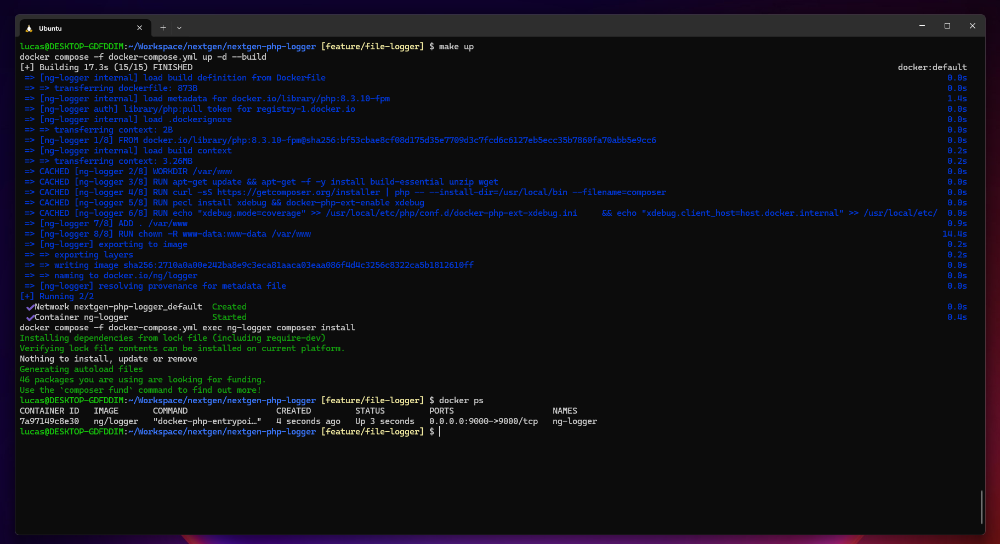
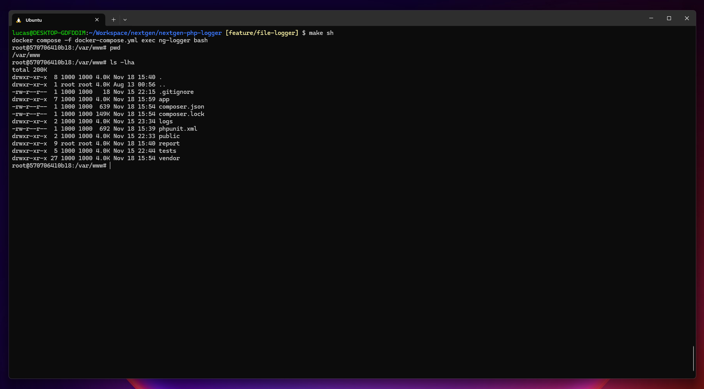
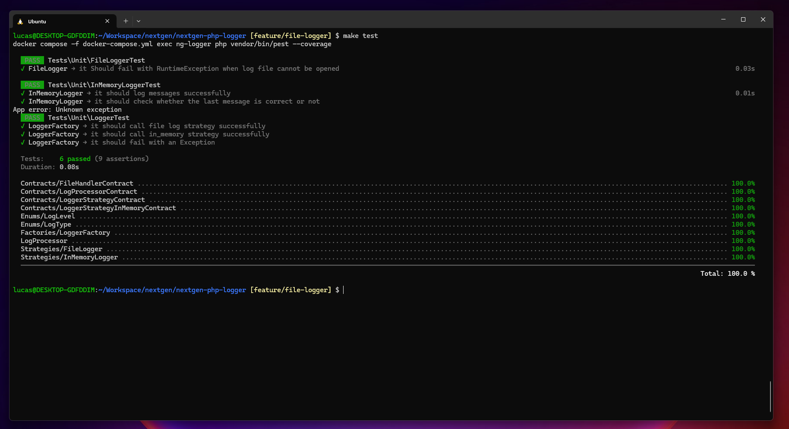
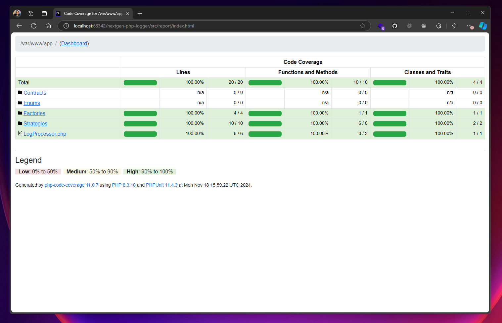
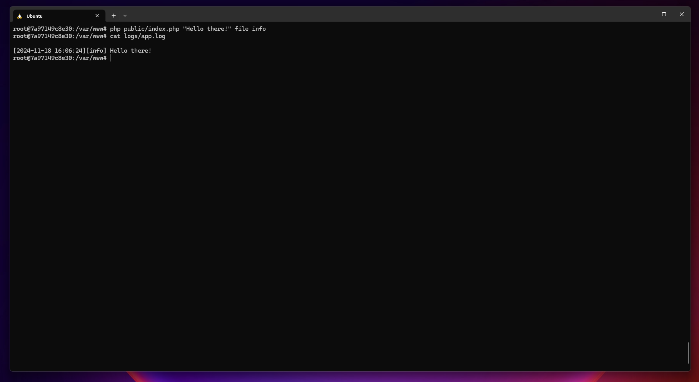

# PHP Logger Project

This project is a PHP-based logging tool designed to simplify logging in PHP applications.

## Exercise
Create a set of classes for logging to files, following the usage below:
The logger should generate a local file with the content, always adding a new line.

```php
<?php

use Mylog\Logger;

$logger = new Logger(new FileLogger('./logs.txt'));

// LogLevel
// Enum: log, alert, danger
$logger->log(level: LogLevel::alert, message: 'Message 1', data: ['data1' => 1, 'data2' => 2]);

$logger->log(level: LogLevel::danger, message: 'Message 3', data: ['data3' => 1, 'data4' => 2]);

$logger->log(level: LogLevel::log, message: 'Message 2', data: ['data5' => 1, 'data6' => 2]);

// Example: Log file output
// 2024-10-28 23:44:33 | alert: [Message 1] [{"data1":1,"data2":2}]
// 2024-10-28 23:45:33 | danger: [Message 3] [{"data3":1,"data4":2}]
// 2024-10-28 23:46:33 | log: [Message 2] [{"data5":1,"data6":2}]
```

## Prerequisites

- **Docker**: Make sure Docker is installed and running on your machine.

## Getting Started

### Build and Start the Project

To start the project, you can use the provided `Makefile` commands:

- **Start the Project**

  ```bash
  make up
  ```
  This will build and start the Docker container, making the PHP logger available.
  

- **Login to the Container**

  ```bash
  make sh
  ```
  This command lets you access the running container's shell.
  

- **Run the Tests**
  ```bash
  make test
  ```
  
- With coverage
  ```bash
  make test-coverage
  ```
  

  Executes the test suite using Pest.

## Running the Logger

Once the container is up, you can get inside the container and run the logger using the following commands:

```bash
make sh
```
And then:
```bash
 php public/index.php "Hello there!" file info
```
where the first argument is the message to be logged, the second argument is the strategy to be used (file, in_memory), and the third argument is the log level (info, alert, danger).


## Running Tests with Pest

To ensure your logger functions correctly, run the test suite using Pest by executing:

```bash
make test
```

This will provide a summary of all tests and their statuses.

## Contributing

Feel free to submit issues, fork the project, and create pull requests to help improve the PHP Logger.

## License

This project is open-source and licensed under the MIT license.
